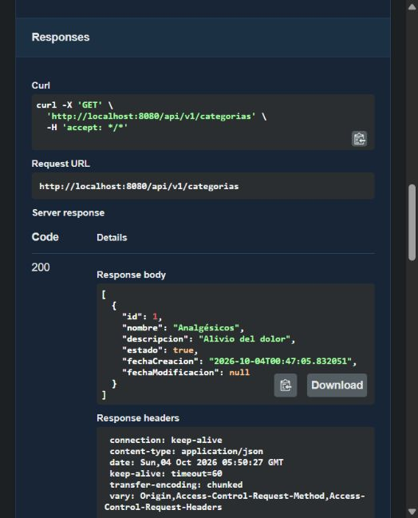
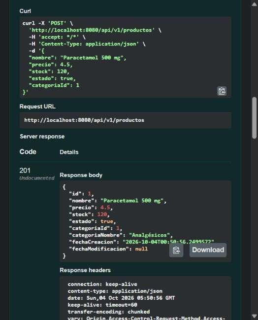
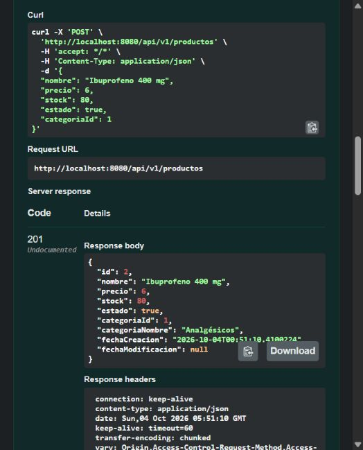
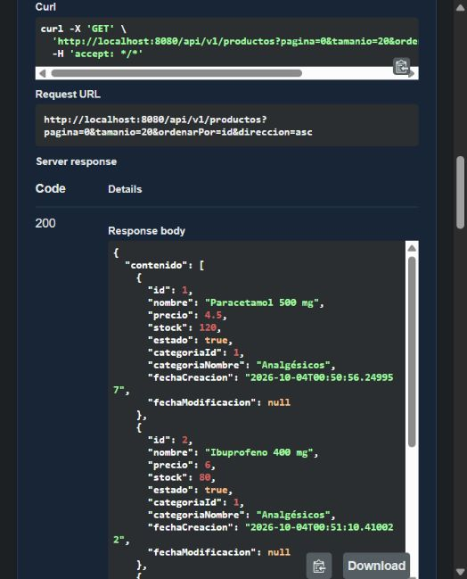
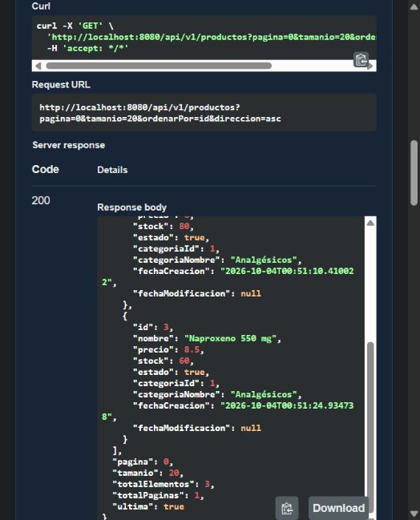
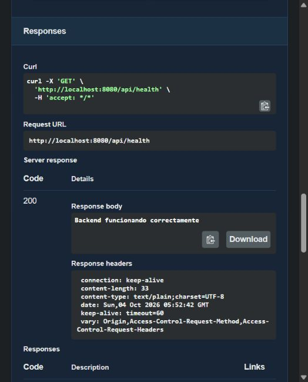

# Guía Práctica N.º 07 — Evidencias del backend

Fecha de verificación: 4 de octubre de 2026 (hora de Lima).

## Alcance

Se verificó el paso 1 de la guía: PharmaSoft en ejecución, prueba de vida, Swagger, categoría y tres productos, y respuesta GET paginada. No se implementó Ktor ni se modificó PharmaMobile. Esta evidencia no acredita todavía la práctica completa.

## Entorno

- Java 21.0.12; ejecución con wrapper Maven y perfil dev.
- PharmaSoft: http://localhost:8080.
- Swagger: http://localhost:8080/swagger-ui.html.
- Oracle: contenedor pharmasoft-oracle, imagen gvenzl/oracle-free:23.26.1-slim-faststart (Oracle AI Database 26ai Free, release 23.26.1).
- Conexión: localhost:1522/FREEPDB1; esquema PHARMADB.
- Flyway: migración V1 aplicada previamente. No se crearon tablas manualmente.
- Compilación y pruebas verificadas previamente: 21 pruebas, sin errores ni fallos.

## Procedimiento y resultados

La categoría Analgésicos (ID 1, descripción Alivio del dolor, estado true) ya existía antes de esta ejecución. Swagger mostraba un intento repetido de POST con respuesta 409 por nombre duplicado. Se reutilizó la categoría; no se borró ni recreó para fabricar una evidencia de alta. La captura siguiente acredita su existencia mediante GET con respuesta 200, no su POST original.

Se crearon los siguientes productos desde POST /api/v1/productos en Swagger. Cada solicitud respondió 201 Created y utilizó categoriaId 1.

| ID | Producto | Precio | Stock | Resultado |
|---|---|---:|---:|---|
| 1 | Paracetamol 500 mg | 4.50 | 120 | 201 |
| 2 | Ibuprofeno 400 mg | 6.00 | 80 | 201 |
| 3 | Naproxeno 550 mg | 8.50 | 60 | 201 |

Swagger rotula 201 como Undocumented porque su descripción OpenAPI anuncia 200. La respuesta real 201 indica creación exitosa; no es un error HTTP. No se modificó el código para cambiar esta etiqueta.

Se ejecutó GET /api/v1/productos?pagina=0&tamanio=20&ordenarPor=id&direccion=asc. Respondió 200, con los tres productos en contenido, totalElementos 3, totalPaginas 1 y ultima true. El cuerpo completo está guardado en productos-get.json. El JSON es un objeto paginado, no una lista simple. Debido al área desplazable de Swagger, la evidencia se divide en dos capturas.

Se ejecutó GET /api/health desde Swagger. Respondió 200 con el texto Backend funcionando correctamente.

## Alcance histórico y avance posterior

Estas capturas acreditan la etapa backend del 4 de octubre de 2026. Posteriormente, el reporte del trabajo en PharmaMobile informó integración GET paginada, ejecución Android, recuperación de error de red, 18 pruebas exitosas y publicación de la rama feature/ktor-client-Gutierrez. Esos resultados posteriores se documentan en el repositorio móvil; no fueron ejecutados nuevamente al preparar estos commits del backend. La ejecución real iOS sigue pendiente de macOS/Xcode.
- El POST desde la aplicación móvil corresponde a la sesión 8, no a esta sesión.

Durante la captura original no se realizó push ni se modificó código del repositorio: solo se añadieron los tres productos mediante Swagger. En la preparación documental posterior, las evidencias se incorporaron a este repositorio sin alterar sus imágenes ni modificar los datos de Oracle. La categoría ya existía: no se dispone aquí de captura de su POST original.
